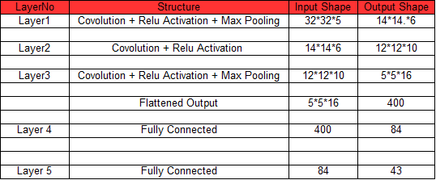

# Self-Driving Car Engineer Nanodegree
# Deep Learning
## Project: Build a Traffic Sign Recognition Program

## Summary:
This repo contains my submission for the traffic sign recognition project for Udacity's Self-Driving Car Engineer Nanodegree program.

- `/Traffic_Sign_Classifier.ipynb` contains the executed code from image loading to training and testing the deep neural network
- `/TrafficSignClassifierReport.pdf` contains detailed report.
- `/new_images2` contains 5 sample 32x32 color test images of signs used to challenge the trained network

## Network Performance:
The final network has training and validation accuracies of over 93% and a testing accuracy of over 91%.

## Network Architecture:
My final architecture involves a convolutional neural network (CNN) similar to that of LeNet, but with extra convolution layer explained as below:

Below are the normalised graiscaled sample images:

Model correctly predicted 4 out of 5 images:

