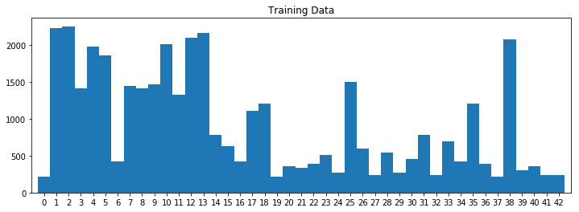
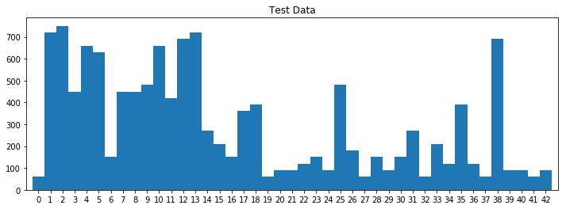
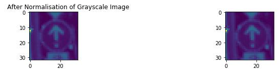
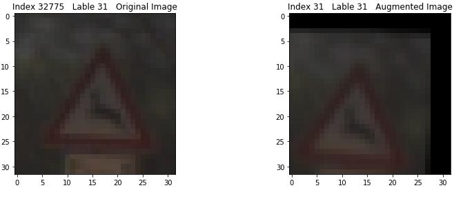
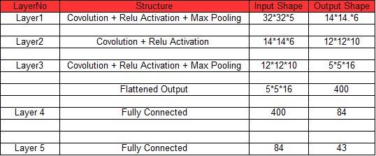
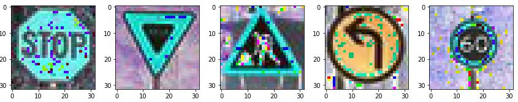
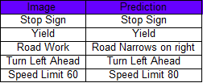
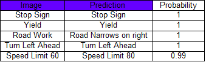

##Data Set Summary & Exploration
Following are the statistics summary done using numpy. Its detailed in Cell2 and Cell7:
* The size of training set is 39209. I have doubled it to 78418 by trasforming images by rotation and
translation.
* The size of test set is 12630.
* The shape of a traffic sign image is 32*32*3
* The number of unique classes/labels in the data set is 43

##2. Exploratory visualization of the dataset:
The code for this step is contained in the 3 to 4 Cell of the IPython notebook.

##Design and Test a Model Architecture
1. Describe how, and identify where in your code, you preprocessed the image data. What tecniques
were chosen and why did you choose these techniques? Consider including images showing the
output of each preprocessing technique. Pre-processing refers to techniques such as converting to
grayscale, normalization, etc.
Normalisation also used so that it distribute the data well and leads to stable convergence. Please
look at the Cell10
Here is an example of a traffic sign image before and after normalisation

2. Describe how, and identify where in your code, you set up training, validation and testing data.
How much data was in each set? Explain what techniques were used to split the data into these sets.
(OPTIONAL: As described in the "Stand Out Suggestions" part of the rubric, if you generated
additional data for training, describe why you decided to generate additional data, how you
generated the data, identify where in your code, and provide example images of the additional data)
The code for splitting the data into training and validation sets is contained in the fifth code cell 12
of the IPython notebook.
To cross validate my model, I randomly split the training data into a training set and validation set. I
did this by train_test_split function of sklearn.
My final training set had 62734 number of images. My validation set and test set had 15684 and
12630 number of images respectively.
The 6 code cell of the IPython notebook contains the code for augmenting the data set. I decided to
generate additional data to avoid probable underfitt. Available training images are 39209. I have
doubled the training size by rotating image by 30 and translating by 10. cv2.warpAffine function is
used to get the transformed image.
Here is an example of an original image and an augmented image:

The difference between the original data set and the augmented data set is augmented data is rotated
by 40 and translated by 10.
3. Describe, and identify where in your code, what your final model architecture looks like
including model type, layers, layer sizes, connectivity, etc.) Consider including a diagram and/or
table describing the final model.
The code for my final model is located in the 13th cell of the ipython notebook. Structure is adopted
from LeNet model. I have added one convolution layer to it.
##My final model consisted of the following layers:

4. Describe how, and identify where in your code, you trained your model. The discussion can
include the type of optimizer, the batch size, number of epochs and any hyperparameters such as
learning rate.
The code for training the model is located in the 18th cell of the ipython notebook.
I have started with Lenet model. It was resulting into low accuracy around 80 percent when tried on
normalised and augmented images. I have tried even with epoch size of 100 and learning rate of
0.0001. But had not showed any improvement. Batch size from 128 to 256 have not showed any
differrence too. Then I added extra fully connected layer, with and without 0.5 of dropput, But results
into same accuracy.Even chaged the filter size for convolution layers has no effect on the model. Lastly
I have added one convolution layer which results in accuracy of around 90 to 93 percent. So the final
model is Lenet plus one convolution layer.
5. Describe the approach taken for finding a solution. Include in the discussion the results on the
training, validation and test sets and where in the code these were calculated. Your approach may
have been an iterative process, in which case, outline the steps you took to get to the final solution
and why you chose those steps. Perhaps your solution involved an already well known
implementation or architecture. In this case, discuss why you think the architecture is suitable for
the current problem.
The code for calculating the accuracy of the model is located in the 19 cell of the Ipython notebook.
LayerNo Structure Input Shape Output Shape
Layer1 Covolution + Relu Activation + Max Pooling 32*32*5 14*14.*6
Layer2 Covolution + Relu Activation 14*14*6 12*12*10
Layer3 Covolution + Relu Activation + Max Pooling 12*12*10 5*5*16
Flattened Output 5*5*16 400
Layer 4 Fully Connected 400 84
Layer 5 Fully Connected 84 43
Started with Lenet structure, observed aroud 92 percent accuracy. But when studied on normalised and
augmented results, accuracy on training set decreased to 70-80 percent. Next tried with epoch from 20
to 100 and learning rate from 0.001 to 0.0001.Results improved till 80- 85 percent.Above epoch size of
60 and learning rate of 0.005 has not showed any imrovement. Then tried with extra fully connected
layer with and without dropout(0.5), which gives no better solution. Next changed the different filter
sizes for weights. But deafult sizes looks better. Finally when I added the extra convolution layer results
got improvement from 85 to 93 percents. There may be some solutions like inception modules to
increase the accuracy further. But I have not tried it. So this model looks good for the given problem
My final model results were:
* training set accuracy of 91
* validation set accuracy of 91
* test set accuracy of 90
If an iterative approach was chosen:
* What was the first architecture that was tried and why was it chosen?
LeNet was chosen as I have already worked on it in Lab and it worked well on first trial (on original
dataset without normalisation and augmentation)
* What were some problems with the initial architecture?
After augmentation and normalisation it showed less accuracy. It looks underfitting the data.
* How was the architecture adjusted and why was it adjusted? Typical adjustments could include
choosing a different model architecture, adding or taking away layers (pooling, dropout,
convolution, etc), using an activation function or changing the activation function. One common
justification for adjusting an architecture would be due to over fitting or under fitting. A high
accuracy on the training set but low accuracy on the validation set indicates over fitting; a low
accuracy on both sets indicates under fitting.
I tried to increase the accuracy by increasing one fully connected layer with and without dropout.
But had not showed any improvement. Then tried on different filter sizes for the weights with no
solution. Lastly added one convolution layer with Relu activation, which showed significant
improvement. Underfitting was avoided by augmenting the data by transforming the images.
* Which parameters were tuned? How were they adjusted and why?
Worked on different batch sizes from 128 to 256. But lastly decided on 128 as it was best suitable
for given architecture. 256 also worked well but minute drop in accuracy.
Tried learning rate from 0.001 to 0.0001. Upto 0.005 model showed good improvement. But after
that almost zero change in accuracy for the all the different model I tried.
Epochs alsoshowed similar results. Above 70 it showed no improvement in the accuracy. Very small
difference observed from 40 to 70. But with 40 model shows underfitting effect when tested on real
images.
* What are some of the important design choices and why were they chosen? For example, why
might a convolution layer work well with this problem? How might a dropout layer help with
creating a successful model?
Adding convolution layer helped as it extracted more features for the given problem. Adding fully
connected layer has not helped to increase the accuracy(even without dropout assoming it will avoid
underfitting). But dont know the reason.
If a well known architecture was chosen:
* What architecture was chosen?
LeNet. Added with one convolution layer
* Why did you believe it would be relevant to the traffic sign application?
Already have some data avaialble with the LeNet reults and it worked well on original dataset.
* How does the final model's accuracy on the training, validation and test set provide evidence that
the model is working well?
Tested the model on number of images. It showed good prediction on the images. Out of 5 images
3-5 images predicted well for number of trials.
##Test a Model on New Images
1. Choose five German traffic signs found on the web and provide them in the report. For each
image, discuss what quality or qualities might be difficult to classify.
Here are five German traffic signs that I found on the web:

2. Discuss the model's predictions on these new traffic signs and compare the results to predicting
on the test set. Identify where in your code predictions were made. At a minimum, discuss what the
predictions were, the accuracy on these new predictions, and compare the accuracy to the accuracy
on the test set (OPTIONAL: Discuss the results in more detail as described in the "Stand Out
Suggestions" part of the rubric).
The code for making predictions on my final model is located in the tenth 24th cell of the Ipython
notebook.
###Here are the results of the prediction:

The model was able to correctly guess 3 of the 5 traffic signs, which gives an accuracy of 60%. I
think last image also predicted almost well. So I can say its 70%.This compares favorably to the
accuracy on the test set of 90 percent.
Image Prediction
Stop Sign Stop Sign
Yield Yield
Road Work Road Narrows on right
Turn Left Ahead Turn Left Ahead
Speed Limit 60 Speed Limit 80
First Image predicted well as it is very distinct from rest of the lables available.So feature might
have been combined well in the fully connected layers.
The second image has got classified well due to same reason. Plus as I have used colored data.
Similar shapes might exists in the lables, but might have been classified well in the convolution
layers due to its different colors than similar shaped lables.
Third image is really confusing due to its similarity with the similar lables and small fetures. I think
more convolution layers needed to extraxt more details with the similar images
Fourth image is predcted well due to its lesser fetures. But it could have been confused with similar
signs like going ahead and right. But as I have used rotation transformation in the preprocessing
stage, this gave good prediction.
Last image though wrongly predicted. It worked well. Model has confused about the numer 6 and 8.
#3. Describe how certain the model is when predicting on each of the five new images by looking at
the softmax probabilities for each prediction and identify where in your code softmax probabilities
were outputted. Provide the top 5 softmax probabilities for each image along with the sign type of
each probability. (OPTIONAL: as described in the "Stand Out Suggestions" part of the rubric,
visualizations can also be provided such as bar charts)
The code for making predictions on my final model is located in the 24th cell of the Ipython
notebook.
For the first image, the model is relatively sure that this is a stop sign (probability of 0.6), and the
image does contain a stop sign. The top five soft max probabilities were

Dont understand how the model gave wrong prediction on Road work sign with so much of
confidence. Rest of the images are worked well and can be justified. |
Image Prediction Probability
Stop Sign Stop Sign 1
Yield Yield 1
Road Work Road Narrows on right 1
Turn Left Ahead Turn Left Ahead 1
Speed Limit 60 Speed Limit 80 0.99
